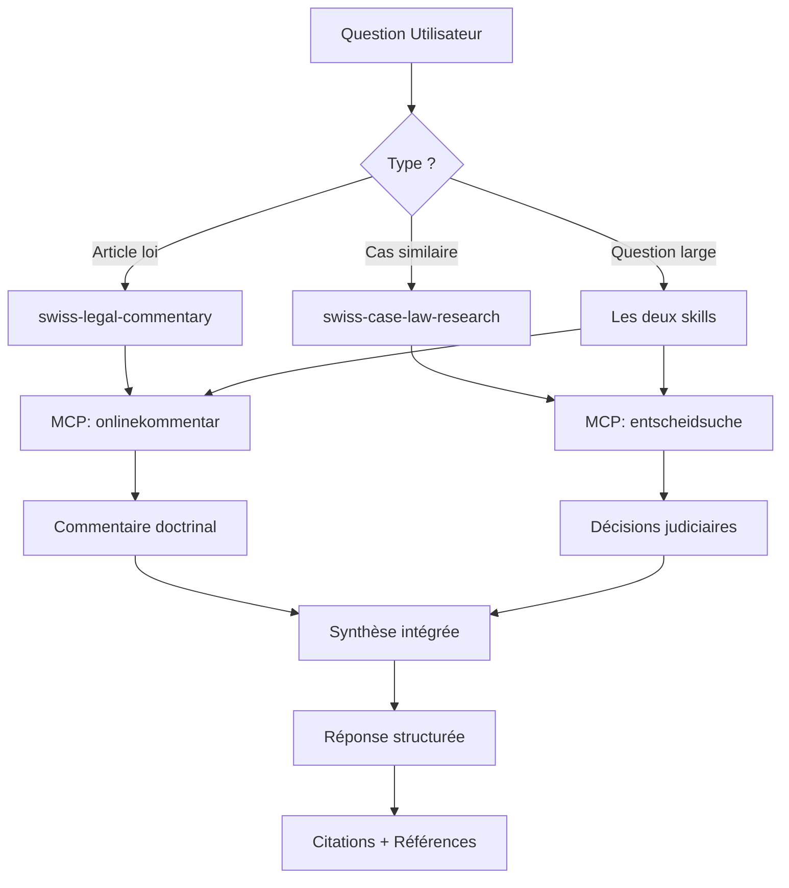

# ✅ Installation Complète - Legal Assistant avec MCP Skills

## 📦 Ce Qui A Été Installé

### 1. Serveurs MCP

#### entscheidsuche-mcp
- **Localisation** : `mcp-servers/entscheidsuche-mcp/`
- **État** : ✅ Compilé et prêt
- **Fonction** : Recherche dans >1M décisions judiciaires suisses
- **API** : https://entscheidsuche.ch

#### onlinekommentar-mcp
- **Localisation** : `mcp-servers/onlinekommentar-mcp/`
- **État** : ✅ Compilé et prêt
- **Fonction** : Accès commentaires doctrinaux suisses
- **API** : https://onlinekommentar.ch/api

### 2. Skills OpenWork

#### swiss-case-law-research
- **Localisation** : `.opencode/skills/swiss-case-law-research/SKILL.md`
- **Taille** : 807 lignes de documentation
- **MCP** : entscheidsuche
- **Contenu** :
  - Structure judiciaire suisse complète (fédéral + 26 cantons)
  - 5 stratégies de recherche détaillées
  - Syntaxe Elasticsearch avec exemples
  - Workflow en 5 phases
  - Vocabulaire juridique multilingue (DE/FR/IT)
  - 4 cas d'usage pratiques
  - Glossaire des tribunaux et lois
  - Gestion des limitations (>1M décisions)

#### swiss-legal-commentary
- **Localisation** : `.opencode/skills/swiss-legal-commentary/SKILL.md`
- **Taille** : 987 lignes de documentation
- **MCP** : onlinekommentar
- **Contenu** :
  - Catalogue des actes législatifs couverts
  - 5 stratégies de recherche thématiques
  - Workflow intégré doctrine + jurisprudence
  - Format de réponse académique
  - Recherche multilingue systématique
  - 4 cas d'usage pratiques
  - Glossaire juridique multilingue
  - Combinaison avec case-law-research

### 3. Documentation

#### Guide Principal
- **Fichier** : `README.md`
- **Contenu** : Vue d'ensemble du projet, installation, usage

#### Guide de Démarrage
- **Fichier** : `QUICKSTART.md`
- **Contenu** : Premiers pas, exemples de questions, commandes utiles

#### Référence des Outils MCP
- **Fichier** : `MCP_TOOLS_REFERENCE.md`
- **Contenu** : Documentation complète des commandes MCP avec exemples JSON

#### Guide d'Utilisation des Skills
- **Fichier** : `SKILLS_GUIDE.md`
- **Contenu** : Guide de référence rapide pour utiliser les skills juridiques

#### Documentation MCP
- **Fichier** : `mcp-servers/README.md`
- **Contenu** : Détails techniques des serveurs MCP

### 4. Scripts et Configuration

#### Script de Gestion
- **Fichier** : `manage-mcp.sh`
- **Fonction** : Gestion des serveurs MCP (status, install, update, test)
- **Usage** : `./manage-mcp.sh [commande]`

#### Configuration MCP
- **Fichier** : `.opencode/mcp.json`
- **Contenu** : Configuration des serveurs pour OpenWork

#### Configuration Workspace
- **Fichier** : `.opencode/openwork.json`
- **Contenu** : Métadonnées du workspace

#### GitIgnore
- **Fichier** : `.gitignore`
- **Contenu** : Fichiers à exclure du versioning

## 🎯 Capacités Activées

### Recherche de Jurisprudence

✅ Recherche dans >1 million de décisions judiciaires  
✅ Couverture : Tribunaux fédéraux + 26 cantons  
✅ Langues : Allemand (70%), Français (25%), Italien (5%)  
✅ Période : 1875-2024  
✅ Formats : JSON, HTML, PDF  
✅ Filtrage avancé par tribunal, date, canton  

### Accès à la Doctrine

✅ Commentaires juridiques de haute qualité  
✅ Auteurs académiques reconnus  
✅ Commentaires article par article  
✅ Multilingue : DE, FR, IT, EN  
✅ Références croisées automatiques  
✅ Open Access (gratuit)  

### Intelligence de Recherche

✅ 5 stratégies de recherche optimisées par skill  
✅ Workflows structurés en 5 phases  
✅ Gestion de grandes bases de données  
✅ Recherche multilingue systématique  
✅ Combinaison doctrine + jurisprudence  
✅ Citations académiques correctes  
✅ Formats de réponse standardisés  

## 📊 Statistiques

| Métrique | Valeur |
|----------|--------|
| **Serveurs MCP installés** | 2 |
| **Skills créées** | 2 |
| **Documentation totale** | ~1,800 lignes |
| **Décisions accessibles** | >1,000,000 |
| **Commentaires disponibles** | ~500+ |
| **Tribunaux couverts** | 30+ |
| **Langues supportées** | 4 (DE, FR, IT, EN) |
| **Actes législatifs** | 20+ lois principales |
| **Fichiers doc créés** | 8 |

## 🚀 Prochaines Étapes

### 1. Activation (IMPORTANT)

```bash
# Redémarrer OpenWork pour activer les serveurs MCP
# Les skills seront automatiquement disponibles
```

### 2. Test Initial

Essayez ces questions pour tester les skills :

**Jurisprudence** :
```
"Cherche des décisions récentes sur la protection des données en Suisse"
"Trouve des arrêts du Tribunal fédéral sur le licenciement abusif"
```

**Doctrine** :
```
"Explique-moi l'article 328 du Code des Obligations"
"Que dit la doctrine sur la protection de la personnalité au travail ?"
```

### 3. Lectures Recommandées

1. **SKILLS_GUIDE.md** (commencer ici) - Guide de référence rapide
2. **QUICKSTART.md** - Exemples pratiques
3. **swiss-case-law-research/SKILL.md** - Détails recherche jurisprudence
4. **swiss-legal-commentary/SKILL.md** - Détails recherche doctrine

### 4. Commandes Utiles

```bash
# Vérifier l'état des serveurs
./manage-mcp.sh status

# Mettre à jour les serveurs
./manage-mcp.sh update-all

# Voir l'aide
./manage-mcp.sh help
```

## 📖 Architecture du Système

```
legal-assistant/
│
├── Serveurs MCP (Backend)
│   ├── entscheidsuche-mcp/
│   │   ├── src/index.ts          → Implémentation serveur
│   │   └── build/index.js         → Compilé, prêt
│   └── onlinekommentar-mcp/
│       ├── src/index.ts          → Implémentation serveur
│       └── build/index.js         → Compilé, prêt
│
├── Configuration OpenWork
│   └── .opencode/
│       ├── mcp.json              → Config serveurs MCP
│       ├── openwork.json         → Config workspace
│       └── skills/
│           ├── swiss-case-law-research/
│           │   └── SKILL.md       → 807 lignes guidance
│           └── swiss-legal-commentary/
│               └── SKILL.md       → 987 lignes guidance
│
├── Documentation Utilisateur
│   ├── README.md                 → Vue d'ensemble
│   ├── QUICKSTART.md             → Démarrage rapide
│   ├── SKILLS_GUIDE.md           → Guide référence
│   ├── MCP_TOOLS_REFERENCE.md    → Référence technique
│   └── mcp-servers/README.md     → Doc serveurs
│
└── Utilitaires
    ├── manage-mcp.sh             → Script gestion
    ├── .gitignore                → Exclusions git
    └── opencode.jsonc            → Config projet
```

## 🔄 Workflow Type



## 🎓 Exemples d'Usage Avancé

### Cas 1 : Recherche Exhaustive

**Question** : *"Analyse complète de la protection de la personnalité au travail"*

**Workflow automatique** :

1. **swiss-legal-commentary** → Commentaire Art. 328 CO
2. **swiss-case-law-research** → Jurisprudence BGer
3. **Synthèse** → Doctrine + Jurisprudence + Application

**Résultat** : Réponse de niveau académique avec :
- Cadre juridique théorique
- Application jurisprudentielle
- Évolution dans le temps
- Références complètes

### Cas 2 : Veille Juridique

**Question** : *"Quelles sont les nouveautés en droit de la protection des données (2023-2024) ?"*

**Workflow automatique** :

1. **swiss-legal-commentary** → Nouveaux commentaires LPD
2. **swiss-case-law-research** → Décisions récentes (filtre temporel)
3. **Synthèse** → Tendances + Changements

**Résultat** : Bulletin de veille avec :
- Nouvelles décisions importantes
- Évolution doctrinale
- Impacts pratiques

### Cas 3 : Question Citoyenne

**Question** : *"Un employeur peut-il lire mes emails professionnels ?"*

**Workflow automatique** :

1. **swiss-legal-commentary** → Art. 328 CO (vulgarisé)
2. **swiss-case-law-research** → Cas concrets
3. **Synthèse** → Réponse pratique

**Résultat** : Explication claire avec :
- Principe juridique simple
- Exemples concrets
- Limites et exceptions
- Recommandation consulter avocat

## 🔧 Maintenance et Mises à Jour

### Mise à Jour des Serveurs MCP

```bash
# Mettre à jour tous les serveurs
./manage-mcp.sh update-all

# Ou individuellement
./manage-mcp.sh update entscheidsuche-mcp
./manage-mcp.sh update onlinekommentar-mcp
```

### Vérification de Santé

```bash
# État des serveurs
./manage-mcp.sh status

# Test fonctionnel
./manage-mcp.sh test entscheidsuche-mcp
./manage-mcp.sh test onlinekommentar-mcp
```

### Accès aux Logs

```bash
# Logs OpenWork
ls -la logs/

# Logs MCP (si disponibles)
# Vérifier dans la sortie d'erreur standard d'OpenWork
```

## ⚠️ Notes Importantes

### Limitations Connues

1. **Volume de requêtes** : Pas de limite API connue, mais utilisation raisonnable recommandée
2. **Couverture doctrine** : Onlinekommentar en développement continu, tous articles pas encore commentés
3. **Langues** : Pas tous commentaires disponibles dans toutes langues
4. **Formats PDF** : Pas toujours disponibles pour toutes décisions

### Considérations Légales

⚖️ **Avertissement Important** :

Les outils fournis donnent accès à des informations juridiques publiques à des fins de recherche uniquement. Ils ne constituent PAS :
- Un avis juridique
- Un substitut à consultation d'avocat
- Une garantie d'exhaustivité
- Une recommandation d'action légale

👨‍⚖️ **Toujours consulter un professionnel qualifié** pour :
- Cas concrets nécessitant représentation
- Décisions avec conséquences juridiques
- Procédures judiciaires
- Rédaction d'actes officiels

## 📞 Support

### Documentation

- Issues GitHub des serveurs MCP :
  - https://github.com/self-tech-labs/entscheidsuche-MCP-server/issues
  - https://github.com/self-tech-labs/onlinekommentar-mcp/issues

### Ressources

- Site Entscheidsuche : https://entscheidsuche.ch
- Site Onlinekommentar : https://onlinekommentar.ch
- Documentation OpenWork : Documentation dans `.opencode/`

### Dépannage

Consultez :
1. `QUICKSTART.md` - Section dépannage
2. `mcp-servers/README.md` - Troubleshooting technique
3. `SKILLS_GUIDE.md` - Problèmes d'usage

## 🎉 Conclusion

Vous disposez maintenant d'un **assistant juridique de niveau professionnel** capable de :

✅ Naviguer dans >1 million de décisions judiciaires  
✅ Accéder à des commentaires doctrinaux de qualité  
✅ Combiner jurisprudence et doctrine intelligemment  
✅ Gérer recherches multilingues complexes  
✅ Fournir réponses structurées et citées correctement  
✅ S'adapter à différents niveaux d'expertise utilisateur  

**Prêt à commencer votre recherche juridique ! 🚀**

---

**Installation réalisée** : Février 2026  
**Version** : 1.0.0  
**Serveurs MCP** : entscheidsuche v1.0.0, onlinekommentar v1.0.0  
**Skills** : swiss-case-law-research v1.0.0, swiss-legal-commentary v1.0.0  

**Crédits** :
- Serveurs MCP : [self-tech-labs](https://github.com/self-tech-labs)
- Entscheidsuche.ch : Jurisprudence suisse open access
- Onlinekommentar.ch : Commentaires juridiques open access
- OpenWork : Framework MCP et skills
